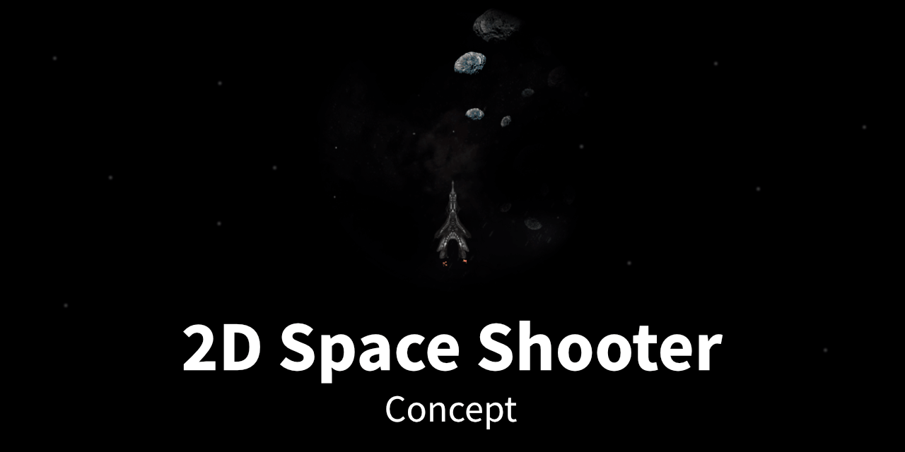

# Silent Space - Experimental space shooter

Atmospheric and experimental 2D game concept.

- [About](#about)
- [Examples](#examples)
- [How to use](#how-to-use)
- [Issues](#issues)
- [Credits](#credits)
- [Contributors](#contributors)
- [Todo](#todo)

 

---

  

## About

A proof of concept about what can be done with plain Canvas, JavaScript and a bit of auditory and visual trickery.

It's been intended to be somewhat 'arcade-ish', but with a more decent pace and visual focus.

### Playing

There are a few implicit and random mechanics, as these have been simple to realize without too much conceptual complexity.

Besides hopefully enjoying the in-game visuals and audio, there's not much to do yet. Let it run as background animation if you like, get inspired; or challenged by the greatest enemy of all: The monstrous source code.

#### Mechanics

- Every game start (or reload) generates a different background and some ship settings change slightly
- Shooting the weapon might hit something out of screen
  - On every hit, there's a chance to switch weapons randomly

#### Effects

- Background changes position over time
- Shield activation causes HUD flickering
- Being hit by space debris ...
  - changes ship model to broken state
  - causes screen flickering (stereo 3D effect)
  - changes shield color (visible on next activation)

### Code

History

- 2013: Project start, concepts and mostly graphics. Received few random updates over later years.
- 2020: I decided to start rebuilding it with current technologies and skills, but it's quite a process!
- 2023: Rebuild all graphics, new game mechanics, audio, win/lose conditions, additional Fx.

- [View historical release »](https://github.com/ChristianOellers/2D-Space-Shooter-Concept/releases)

### Features & Gameplay

- On each game start the ship attributes, weapons and sounds are slightly randomized.
- You can shoot, toggle the shields and move the ship.
  - Shooting might explode something mysterious out of screen and reward you with a screen shake

There are no actual enemies yet. Please use your nerdy imagination for that.

  

## Examples

Find the live version to play here:

- [Play game »](https://christianoellers.github.io/2D-Space-Shooter-Concept)

  

## How to use

1. Choose a _Desktop_ browser that supports the Canvas API. _(The game does not support a responsive layout, mobile devices or touch gestures.)_
2. If used locally: You'll need a local web server due to cross-origin restrictions with some of the files.

   - Install Node.js and the project dependencies
   - Run `npm run start` to start a local webserver

  

## Issues

### Audio not playing

Browsers might block automatic playing audio. Workaround to manually trigger this: When loading the game, simultaneously click somewhere in the page (fast, one or more times).

Audio files are in `.wav` and `.ogg` format. Your browser might support something which is not available. In that case, please use another browser (like Chrome or Firefox).

### Code quality

As this has been developed as pure proof of concept, across 10+ years so far; it is considered legacy.
There's many bad practices like closely coupled code. Writing a game that involves changing feature sets and design decisions is a time consuming task.
That's why I considered to spend my spare time on developing the game itself, not making the code beautiful.

See it as technology junkyard, to pick from what you need and build your own ;)

  

## Credits

### Audio files

| Type  | Category       | Source      | License                                                      | Content ID                                                        | Author + Website                                                                                              |
| ----- | -------------- | ----------- | ------------------------------------------------------------ | ----------------------------------------------------------------- | ------------------------------------------------------------------------------------------------------------- |
| Sound | Engine         | freesound   | [CC BY 3.0](https://creativecommons.org/licenses/by/3.0)     | [159012](https://freesound.org/people/MortisBlack/sounds/159012)  | [primeval_polypod](https://freesound.org/people/primeval_polypod)                                             |
| Sound | Explosion      | freesound   | [CC0 1.0](https://creativecommons.org/publicdomain/zero/1.0) | [147583](https://freesound.org/people/CaCtUs2003/sounds/147583)   | [CaCtUs2003](https://freesound.org/people/CaCtUs2003)                                                         |
| Sound | Explosion      | freesound   | [CC BY 3.0](https://creativecommons.org/licenses/by/3.0)     | [108640](https://freesound.org/people/juskiddink/sounds/108640)   | [juskiddink](https://freesound.org/people/juskiddink)                                                         |
| Sound | Laser          | freesound   | [CC BY 3.0](https://creativecommons.org/licenses/by/3.0)     | [151020](https://freesound.org/people/bubaproducer/sounds/151020) | [bubaproducer](https://freesound.org/people/bubaproducer)   [Antisample](https://antisample.com)           |
| Sound | Shield Enabled | freesound   | [CC BY 3.0](https://creativecommons.org/licenses/by/3.0)     | [385051](https://freesound.org/people/MortisBlack/sounds/385051)  | [MortisBlack](https://freesound.org/people/MortisBlack)   [SoundCloud](https://soundcloud.com/mortisblack) |
| Music | Ambient        | Danny Grübl | © Copyright                                                  | DG-Space-Ambient                                                  | [hans-sperling](https://github.com/hans-sperling)                                                             |

Some sounds have been edited.

  

## Contributors

Thanks for all the support, help and creative feedback!

- Danny N. Grübl

  

## Todo

### Priority

- Add GitHub link (if viewed via Vercel)
- Update background images to be brighter, nebula, interesting
- Add win/lose condition and end screen
  - e.g. be hit max. 3x (lifes)
- Particles: Can multiple items be quickfixed hacked into?
- Implement Hotkeys for weapons - 1,2
- Implement Mouse click left/right steers like left/right (split screen)
- Fade music from A to B (dramatic sometimes, e.g. 25% chance, never at start)

### Experimental

- Foreground DOM object (display, stereo)
  - Animated by JS, moves/scrolls over screen
  - With SVG mask
  - With Canvas blend-mode OR background-blend

### Cleanup

- Integrate event library
