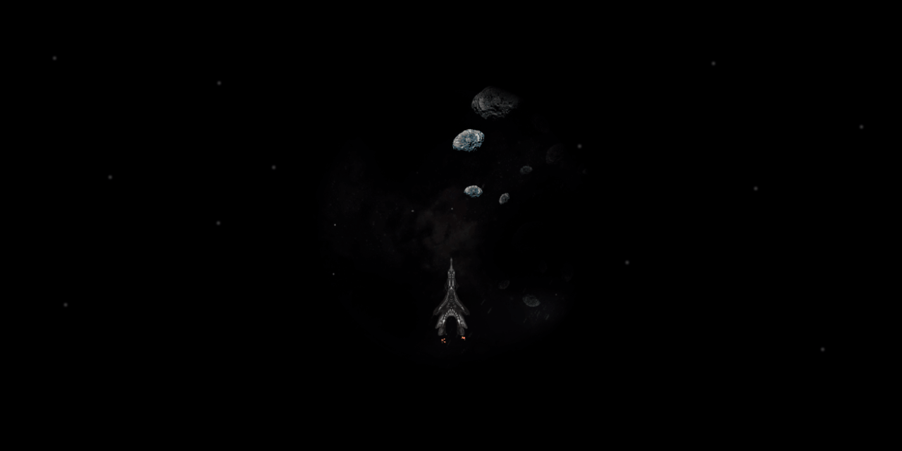

# Experimental game

- [About](#about)
- [Examples](#examples)
- [How to use](#how-to-use)
- [Issues](#issues)
- [Credits](#credits)

 

---

  

## About

A proof of concept about what can be done with plain Canvas, JavaScript and a bit of auditory and visual trickery. It's been intended to be somewhat 'arcade-ish', but with a more decent pace and visual focus.

### Playing

The ship has a few controls to try out. Besides hopefully enjoying the in-game visuals and audio, there's not much to do (no enemies).
Let it run as background animation if you like, get inspired; or challenged by the greatest enemy of all: The monstrous source code 🤓

### Code

The project started in 2013 and received a few random updates over later years. As this is an old project, built on old technologies as proof of concept, please excuse any architectural mess-ups.

### Features & Gameplay

- On each game start the ship attributes, weapons and sounds are slightly randomized.
- You can shoot, toggle the shields and move the ship.
  - Shooting might explode something mysterious out of screen and reward you with a screen shake 😃

There are no actual enemies yet. Please use your nerdy imagination for that.

  

## Examples

Find the live version to play here:

- [Play game »](https://christianoellers.github.io/2D-Space-Shooter-Concept)

  

## How to use

1. Choose a _Desktop_ browser that supports the Canvas API. _(The game does not support a responsive layout, mobile devices or touch gestures.)_
2. If used locally: You'll need a local web server due to cross-origin restrictions with some of the files.

   - Install Node.js and the project dependencies
   - Run `npm run start` to start a local webserver

  

## Issues

### Audio not playing

Browsers might block automatic playing audio. Workaround to manually trigger this: When loading the game, simultaneously click somewhere in the page (fast, one or more times).

Audio files are in `.wav` and `.ogg` format. Your browser might support something which is not available. In that case, please use another browser (like Chrome or Firefox).

  

## Credits

### Audio files

| Type  | Category       | Source      | License                                                      | Content ID                                                        | Author + Website                                                                                              |
| ----- | -------------- | ----------- | ------------------------------------------------------------ | ----------------------------------------------------------------- | ------------------------------------------------------------------------------------------------------------- |
| Sound | Engine         | freesound   | [CC BY 3.0](https://creativecommons.org/licenses/by/3.0)     | [159012](https://freesound.org/people/MortisBlack/sounds/159012)  | [primeval_polypod](https://freesound.org/people/primeval_polypod)                                             |
| Sound | Explosion      | freesound   | [CC0 1.0](https://creativecommons.org/publicdomain/zero/1.0) | [147583](https://freesound.org/people/CaCtUs2003/sounds/147583)   | [CaCtUs2003](https://freesound.org/people/CaCtUs2003)                                                         |
| Sound | Explosion      | freesound   | [CC BY 3.0](https://creativecommons.org/licenses/by/3.0)     | [108640](https://freesound.org/people/juskiddink/sounds/108640)   | [juskiddink](https://freesound.org/people/juskiddink)                                                         |
| Sound | Laser          | freesound   | [CC BY 3.0](https://creativecommons.org/licenses/by/3.0)     | [151013](https://freesound.org/people/bubaproducer/sounds/151013) | [bubaproducer](https://freesound.org/people/bubaproducer)   [Antisample](https://antisample.com)           |
| Sound | Laser          | freesound   | [CC BY 3.0](https://creativecommons.org/licenses/by/3.0)     | [151020](https://freesound.org/people/bubaproducer/sounds/151020) | [bubaproducer](https://freesound.org/people/bubaproducer)   [Antisample](https://antisample.com)           |
| Sound | Shield Enabled | freesound   | [CC BY 3.0](https://creativecommons.org/licenses/by/3.0)     | [385051](https://freesound.org/people/MortisBlack/sounds/385051)  | [MortisBlack](https://freesound.org/people/MortisBlack)   [SoundCloud](https://soundcloud.com/mortisblack) |
| Music | Ambient        | Danny Grübl | © Copyright                                                  | DG-Space-Ambient                                                  | [hans-sperling](https://github.com/hans-sperling)                                                             |
